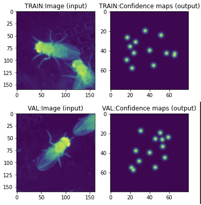
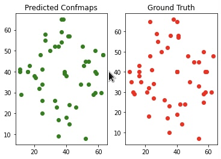

# Post-estimation on animal Body-Parts using SLEAP

This project uses [the SLEAP](https://sleap.ai) deep-learning framework in order
to train a UNet to estimate on body-parts of animals, in this case of flies.

## What is SLEAP?

SLEAP is a deep-learning framework that is built to estimate body-parts of animals
on a given dataset.

Please visit follow [SLEAP's Tutorial](https://sleap.ai/tutorials/tutorial.html)
to better understand and try them out!

## The notebook

We provide a notebook with multiple functions that help manipulate the dataset
a lot more easier.

The dataset that sleap builds are divided into different images.

For example, we can get the instance image of a video and its
confidence maps (X and Y coordinates of where precisely a body-part
is). The output pictures look like this.



After training, we can get the X and Y coordinates of the confidence
maps generated and compare them to the ground truths. We developed a 
function:
```
def get_indx(list_of_GT, list_of_Pred)
```
that helps us get the X and Y indexes of the confidence
maps. With this we can easily compare them to the ground
truths and see how well our network is performing. 



## References

1. Deep Learning. (n.d.). https://www.deeplearningbook.org/. 

2. Pereira, T. D., Tabris, N., Li, J., Ravindranath, S., Papadoyannis, E. S., Wang, Z. Y., Turner, D. M., McKenzie-Smith, G., Kocher, S. D., Falkner, A. L., Shaevitz, J. W., &amp; Murthy, M. (2020, January 1). SLEAP: Multi-animal pose tracking. bioRxiv. https://www.biorxiv.org/content/10.1101/2020.08.31.276246v1. 

3. Pereira, T. D., Shaevitz, J. W., &amp; Murthy, M. (2020, November 9). Quantifying behavior to understand the brain. Nature News. https://www.nature.com/articles/s41593-020-00734-z.

